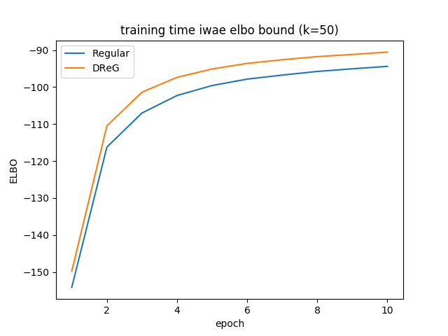
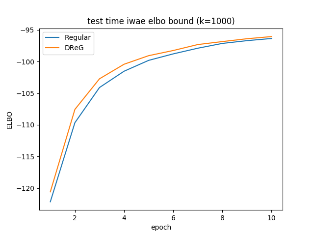

# DReG-PyTorch
A PyTorch re-implementation of "Doubly Reparameterized Gradient Estimators for Monte Carlo Objectives"

## What is DReG?
DReG is a variance reduction technique proposed in the paper "Doubly Reparameterized Gradient Estimators for Monte Carlo Objectives" [1]. The work builds on earlier variance reduction techniques for Monte Carlo estimators in latent variable models and reinforcement learning. The central idea extends from observing a score function term in the gradient of the evidence lower bound [2], and replacing it using the estimate given by the reparameterization trck. Since the reparameterization gradient usually has lower variance than the score function estimator/REINFORCE, the overall Monte Carlo estimator has lower variance. 

## What does DReG do?
* DReG applied to estimating the gradient of the inference network in a latent variable model trained with amortized inference gives lower variance gradients
* Addressed concerns about using tight IWAE bounds during training [3]
* Generalized the gradient estimator in [2] to IWAE without introducing bias
* Potential extensions and applications in sequence models and model-based RL

## Variance Reduction Visualization

## TODOs
- [ ] RWS case
- [ ] JVI case

## References
[1] Tucker, G., Lawson, D., Gu, S. and Maddison, C.J., 2018. Doubly Reparameterized Gradient Estimators for Monte Carlo Objectives. arXiv preprint arXiv:1810.04152.

[2] Roeder, G., Wu, Y. and Duvenaud, D.K., 2017. Sticking the landing: Simple, lower-variance gradient estimators for variational inference. In Advances in Neural Information Processing Systems (pp. 6925-6934).

[3] Rainforth, T., Kosiorek, A.R., Le, T.A., Maddison, C.J., Igl, M., Wood, F. and Teh, Y.W., 2018. Tighter variational bounds are not necessarily better. arXiv preprint arXiv:1802.04537.
